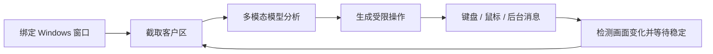

# AEye

AEye 是一个面向 Windows 的视觉桌面智能体实验项目。它可以绑定一个指定窗口，持续截取窗口画面交给多模态大模型判断，并通过键盘、鼠标或实验性的后台消息接口执行操作。

本项目基于 [simular-ai/Agent-S](https://github.com/simular-ai/Agent-S) 修改，重点增加了目标窗口隔离、桌面前端、快速决策、运行日志和长时间循环执行能力。

> [!WARNING]
> AEye 会让模型生成并执行电脑操作。请只在测试环境、测试账号和可承受误操作的窗口中使用，并始终保留人工停止手段。不要用于真实资金交易、未经授权的账号或违反第三方平台规则的场景。

## 功能

- 从当前可见窗口列表中选择并绑定目标窗口。
- 只截取目标窗口客户区，并在窗口移动后重新计算坐标。
- PySide6 图形界面：窗口选择、截图预览、任务输入、模型配置、开始/暂停/停止和实时日志。
- 前台鼠标键盘模式，以及只允许 Tab、方向键、快捷键和文本输入的“仅键盘模式”。
- 实验性后台模式：窗口可被遮挡，但不能最小化；兼容性取决于目标程序。
- 快速模式：主模型直接输出归一化坐标，跳过独立 Grounding 请求以降低延迟。
- 标准模式：主模型负责规划，UI-TARS 等 Grounding 模型负责界面定位。
- 根据画面变化自动等待界面稳定，减少动作尚未完成便进入下一轮的问题。
- 支持有限步数和永久循环；永久循环会持续到手动停止、关闭程序或发生错误。
- 保存最近一次运行的结构化日志，记录观察、行为目标、原因、动作和耗时，但不记录 API Key。
- 为同一局牌维护有限状态记忆，降低重复查看私牌造成的循环。

## 工作流程



## 环境要求

- Windows 10/11
- Python 3.9–3.12
- 单显示器环境效果最好
- 一个 OpenAI 兼容的主模型接口
- 标准模式下还需要一个兼容 OpenAI Chat Completions 的 Grounding 模型接口

当前默认配置为：

- 主模型：`gpt-5.4-mini`
- 主模型 URL：`https://ai.markfan.dpdns.org/v1`
- Grounding：`bytedance/ui-tars-1.5-7b`
- Grounding URL：`https://openrouter.ai/api/v1`

模型名称和 URL 均可在前端中修改。代码不会把 API Key 写入项目配置或运行日志。

## 安装

```powershell
git clone https://github.com/thiopheneche/AEye.git
cd AEye
py -3.11 -m venv .venv
.\.venv\Scripts\Activate.ps1
python -m pip install --upgrade pip
pip install -e .
```

如果 PowerShell 禁止激活脚本，可在当前用户范围调整策略：

```powershell
Set-ExecutionPolicy -Scope CurrentUser RemoteSigned
```

## 配置 API Key

此版本默认从 Windows 环境变量读取以下密钥：

- `fyx_api_key`：主模型接口密钥。
- `OPENROUTER_API_KEY`：标准模式下 UI-TARS/OpenRouter 的密钥；快速模式不需要它。

写入当前用户环境变量：

```powershell
[Environment]::SetEnvironmentVariable("fyx_api_key", "你的主模型密钥", "User")
[Environment]::SetEnvironmentVariable("OPENROUTER_API_KEY", "你的 OpenRouter 密钥", "User")
```

设置后请重新打开终端和 AEye。不要把真实密钥写进源码、README、命令历史截图或提交到 Git。

## 启动图形界面

```powershell
.\start-gui.ps1
```

基本使用方法：

1. 打开并保持目标程序窗口处于非最小化状态。
2. 在 AEye 中刷新窗口列表并选择目标窗口。
3. 输入清晰、可验证的任务目标。
4. 选择运行模式和最大步数，或勾选“永久循环（直到手动停止）”。
5. 点击“开始”，随时可以暂停或停止。

永久循环开启后，“最大步数”会被禁用，状态显示为 `第 N/∞ 步`。

## 运行模式

| 模式 | 说明 | 适用情况 |
| --- | --- | --- |
| 快速模式 | 主模型直接观察并输出 0–1000 归一化坐标 | 对延迟敏感、主模型定位能力较强 |
| 标准模式 | 主模型规划，独立 Grounding 模型定位 | 需要更明确的视觉定位分工 |
| 仅键盘模式 | 禁止点击、拖动和滚轮，仅允许受限键盘操作 | 可用 Tab/方向键完整导航的界面 |
| 前台模式 | 聚焦目标窗口并使用真实系统输入 | 兼容性最好，但会占用鼠标键盘 |
| 实验性后台模式 | 使用 `PrintWindow` 和窗口消息，不抢占前台 | 传统 Win32 程序；Electron、UWP、浏览器和游戏可能不兼容 |

如果窗口只是被其他窗口遮挡，前台模式会在执行前重新聚焦它；后台模式会尝试直接捕获和操作它。如果窗口最小化，后台捕获通常无法得到可靠画面。

## 命令行模式

列出可绑定窗口：

```powershell
.\.venv\Scripts\agent_s.exe --list_windows
```

使用项目内的快捷脚本运行：

```powershell
.\run-window-agent.ps1 `
    -WindowTitle "Untitled - Notepad" `
    -Task "在文档中输入 hello"
```

也可以覆盖默认模型：

```powershell
.\run-window-agent.ps1 `
    -WindowTitle "目标窗口标题" `
    -Task "任务内容" `
    -MainModel "你的模型名称" `
    -GroundingModel "你的 Grounding 模型名称"
```

## 日志与调试

最近一次运行日志位于：

```text
logs/gui_runs/latest.log
```

日志包含：

- 绑定窗口标题、PID、HWND 和初始尺寸。
- 模型与运行模式。
- 每一步的画面分析、行为目标、选择原因和执行代码。
- 模型决策耗时、动作执行结果、画面稳定等待和总耗时。
- 异常堆栈与停止原因。

`logs/` 已被 Git 忽略。提交问题时请先检查日志中是否包含窗口内容、账号信息或其他隐私数据。

## 测试

```powershell
.\.venv\Scripts\python.exe -m compileall -q gui_agents tests
.\.venv\Scripts\python.exe -m unittest discover -s tests -v
python -m black --check gui_agents\s3\gui_app.py tests\test_target_window_mode.py
```

## 已知限制

- 目标窗口不能最小化。
- 多显示器、不同 DPI 缩放和窗口自定义渲染可能影响坐标准确度。
- 后台输入不是所有应用都接受；必要时切回前台模式。
- 视觉模型可能误判，永久循环并不代表可以无人监管。
- 窗口截图只反映可见界面状态，无法代替应用内部 API 或可靠的结构化状态读取。

## 项目来源与许可

AEye 是 [Agent-S](https://github.com/simular-ai/Agent-S) 的衍生版本。原项目由 Simular AI 开发，本仓库保留其历史、版权和 Apache License 2.0 许可文件。

本项目同样按照 [Apache License 2.0](LICENSE) 发布。
